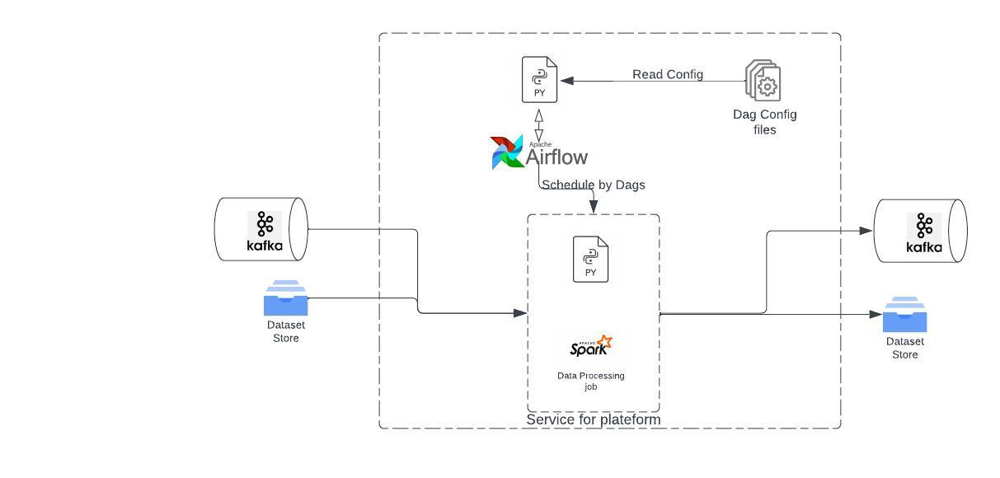
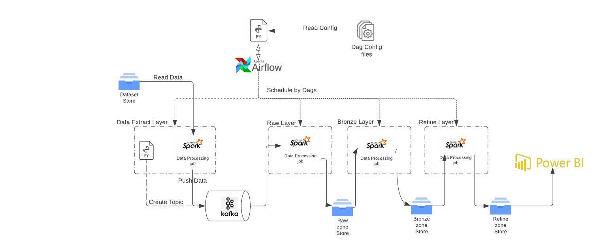
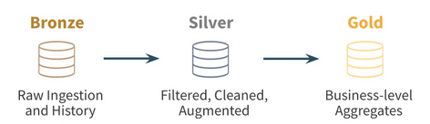

# water-quality-analysis
# Architure for data processing

This service read dags configuration i.e. how many task should be there, type of task, their dependency and working etc are define in config file. Whole services are broken down into smaller module so that they can be used in any order and any number of times to full fill the required need.

## Current Pipeline flow


# Data Zone
 

# Steps to spin up docker container
## All services( airflow, jupyter, kafka)
 To create all services, run below command.

```
make  create-all-services
```
To destroy all container
```
make destroy-all-services
```
to stop all services
```
make stop-all-services
```
to start all services
```
make start-all-services
```

to setup airflow env 
```
make setup-airflow
```

to open services on UI:
<li> kafka: localhost:8080
<li> jupyter: localhost:8085
<li> jupyter container spark ui: localhost:8090
<li> airflow ui: localhost:8095

## To run unit test cases
 To unit test script, run below command.

```
make  run-unit-tests
```